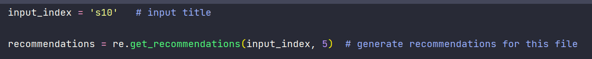
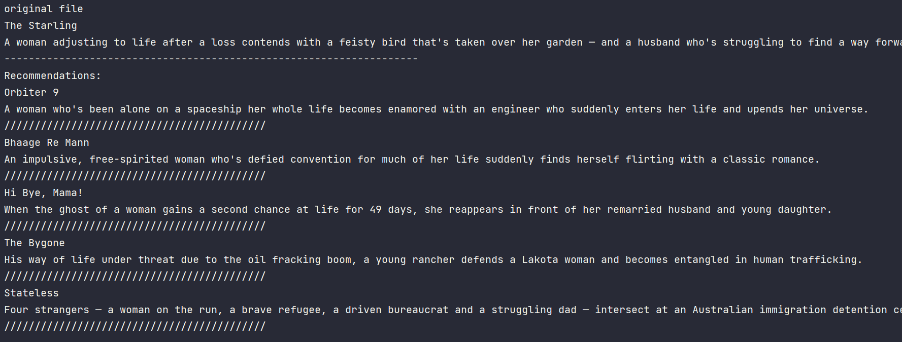

# Recommendation System with Data Structures

Recommender systems are the systems that are designed to recommend things to the user based on many different factors. These systems predict the most likely product that the users are most likely to purchase and are of interest to. Companies like Netflix, Amazon, etc. use recommender systems to help their users to identify the correct product or movies for them. 

With this project, the aim is to build a recommender engine.

### This Recommendation Engine has been built using Data Structure and Algorithm concepts. Machine Learning has not been used.

# Idea

1) For a title, we try to compare the descriptions with all the other titles.
The titles which match the most with our Title are recommended.

2) For each title, we have to generate a common ground on which we can compare the titles.
We can do that by generating a vector which corresponds to how many times the most common words occur in the title's description.
Stop Words and Punctuations aren't considered.

3) For calculating how simmilar 2 titles are, we use cosine simmilarity.
Cosine simmilarity tells us how simmilar 2 vectors are. 

If cosine simmilarity == 1 , the two vectors are exactly same.

If cosine simmilarity == 0, the vectors are nothing alike

4) For each title, we want to get the top Recommendations. To do that, we use Min Heaps.
The Min Heap's,  heap order property depends on the cosine simmilarity. We have built the Heap Node keeping that in mind.

How Min Heaps help us in getting Top Recommendations??

We fill the heap till the time, the desired number of recommendations are not received.
When we have the threshold, we want to kick out the title having the least cosine simmilarity with our title under consideration.
Min Heap's top node will have the least cosine simmilarity. We can add new element and pop the top. We would have removed the title having least simmilarity with our title and would still mantain the threshold of recommendations.

# PseudoCode

#### Pre Recommendations

1) Load the dataset

2) Get the Top 500 occuring words. Take care to not include stop words and punctuations.

We can get the punctuation list from string module.

We can get the list of stop words from this url:
https://gist.githubusercontent.com/sebleier/554280/raw/7e0e4a1ce04c2bb7bd41089c9821dbcf6d0c786c/NLTK's%2520list%2520of%2520english%2520stopwords

3) Get feature dictionary for each record.
We calulate how many times a particular "Top 500" word occurs in the description of a title, for that key in feature dictionary, the value will be 
the number of times the word is occuring.

#### During Recommendations

1) Iterate over all the titles. 

2) Calculate the cosine simmilarity b/w our title's description vector and other title's description vector.

3) Use Min Heaps to get the Top Recommendations. The Min Heap that we are using, mantains its heap order property using the cosine 
simmilarity b/w 2 titles.

# Data Structures used:

Heaps, Dictionaries/ Hash Maps, Lists

# Documentation

data: Folder that contains the Netflix dataset

RecommendationSystem: Package containing the modules and classes for implementing the 
recommendation system.

main.py: Main script of the project.

# Screenshots

#### Input Title. This is the Title for which we are trying to get the Recommendations

#### Output Recommendations.

##### Observations: If we see the Input Title description, it corresponds to  "Women". The main theme is "Women". 

The Recommendations also correspond to "Women". 

